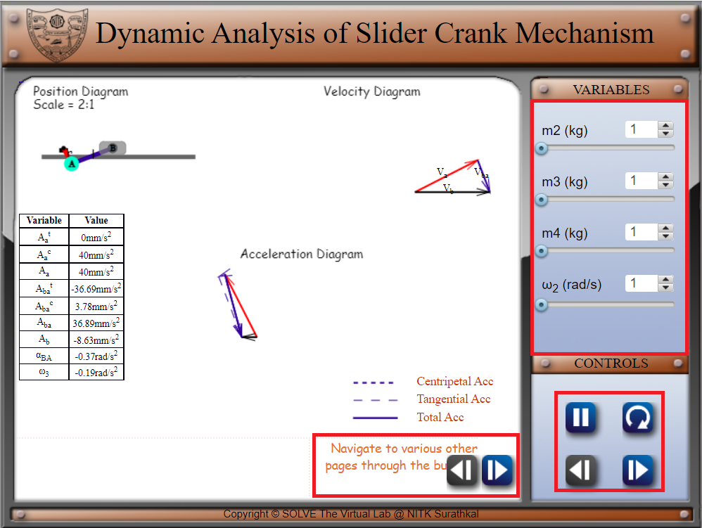
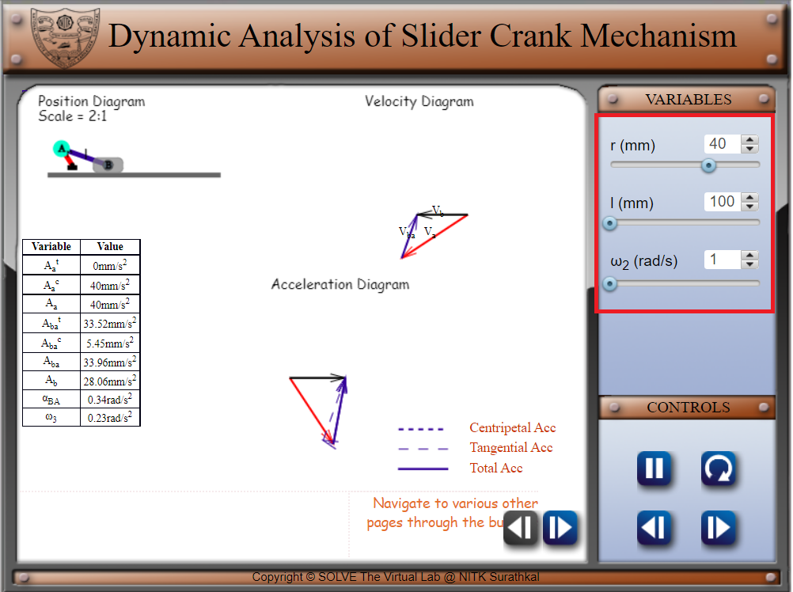
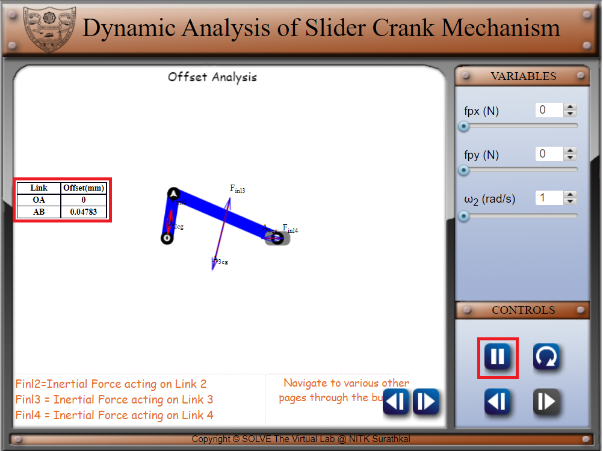
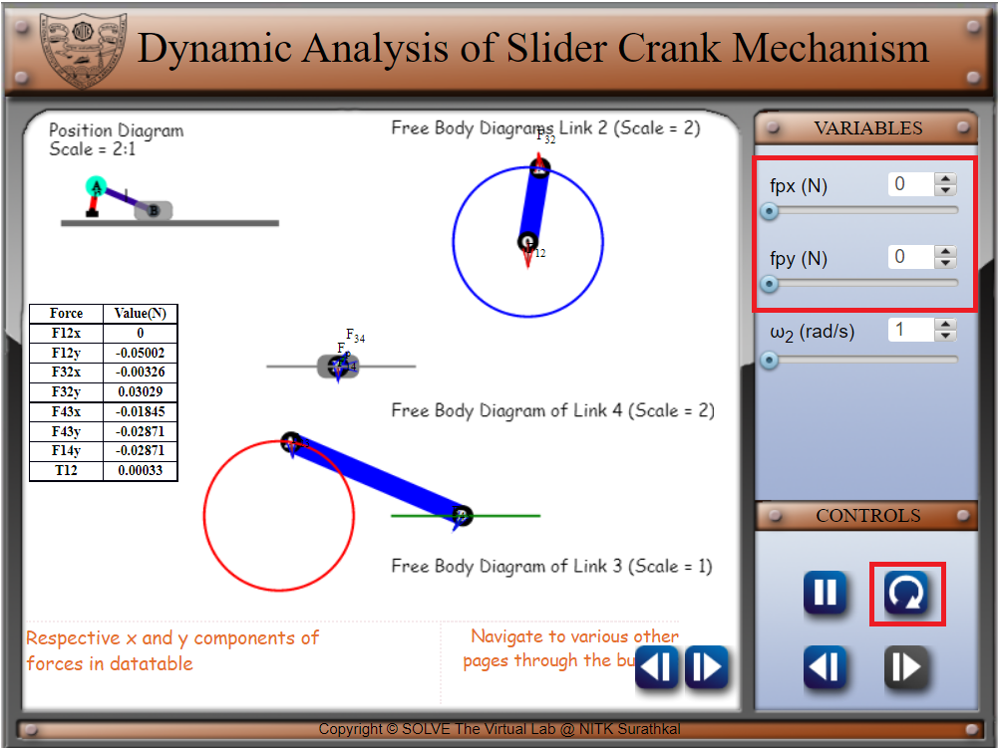
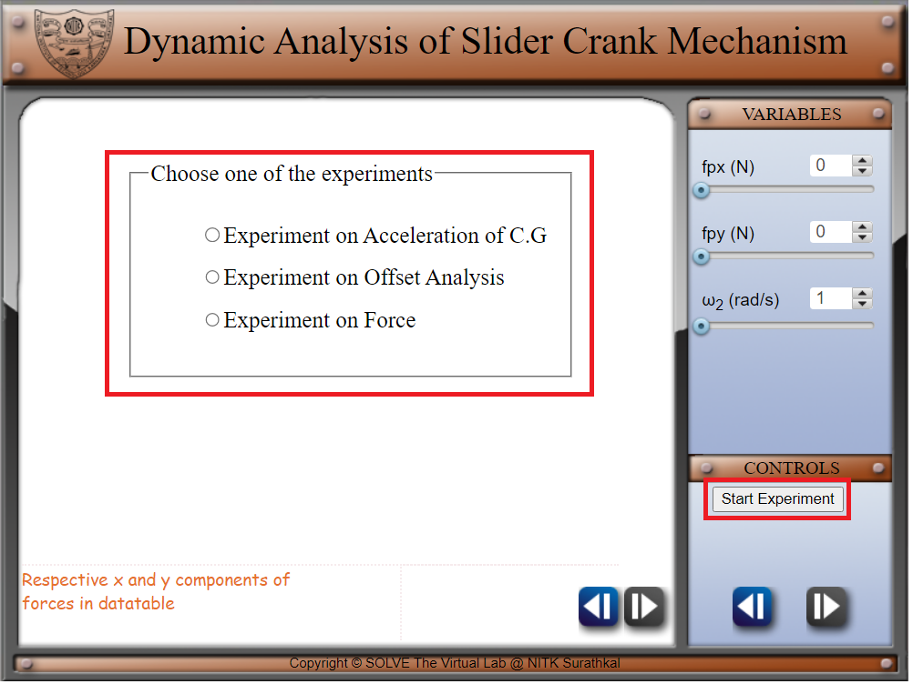
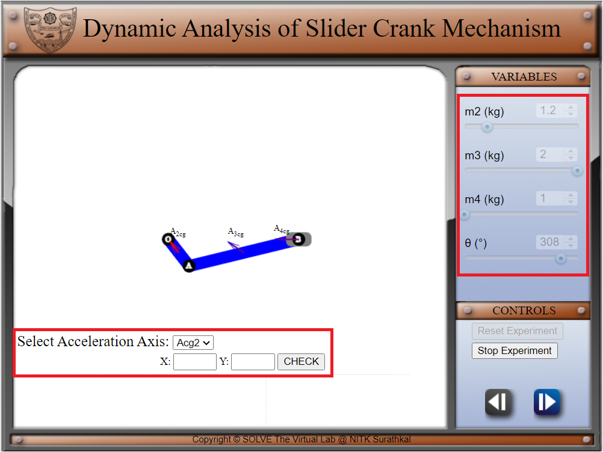
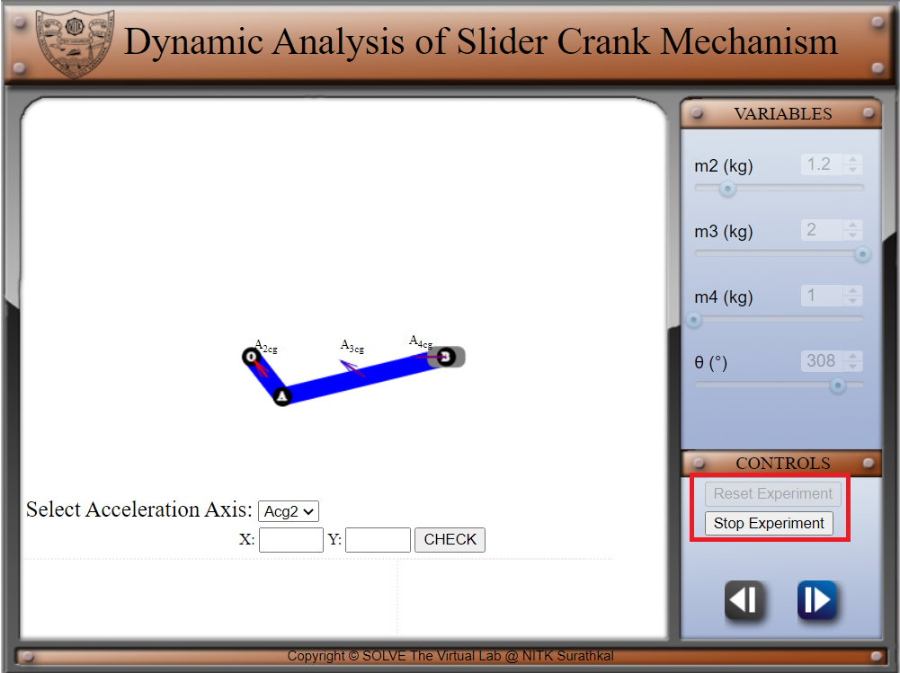

#### These procedure steps will be followed on the simulator

1. In simulation window the motion of position diagram, velocity and acceleration diagram is shown. 
2. There are pointers given on right side of the screen under the variable tab to change the values of m2, m3 m4 and ω2 , and navigation, play/pause and reverse button under control tab. Navigation buttons are given on the simulator screen for the navigation of the simulator screen. 
 

3. After moving on to the next page of simulator screen and variable tab, change value of r, l, and theta of the link 
 

4. Navigate to the next page of the simulator screen. And analyse the offset analysis results from the table after pausing the animation 
 

5. Navigate to the next page of simulator screen and variable tab and change fpx, fpy and reverse the animation using the control tab, then analyse the force on links. 
 

6. Navigating to the next page of simulator will show an experiment page where user can choose any experiment from experiment of acceleration of CG, experiment of offset analysis, experiment of force, user can start the experiment using Start Experiment button under control tab. 
 

7. Selecting any experiment, the simulator will open experiment page where all the variables are constant (randomize after resetting the experiment) in the variable tab and variable tab can be navigate from control tab. User can select any link to perform the experiment on the simulator page in the dropdown bar. User have to use the variables from variable tab for the calculation. The calculated values can be verified using the check box. 
 

8. After performing the experiment, the user can stop the experiment to exit the experiment and choose another experiment or can reset the same experiment using the control tab.  
 
