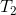
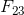
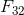
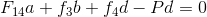
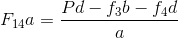
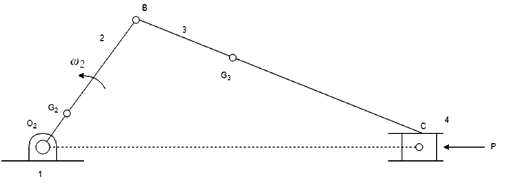
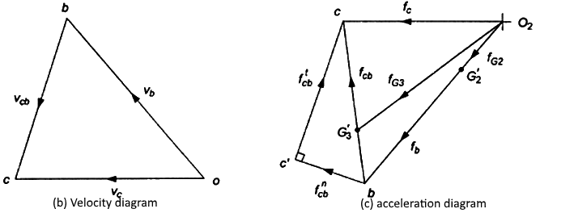
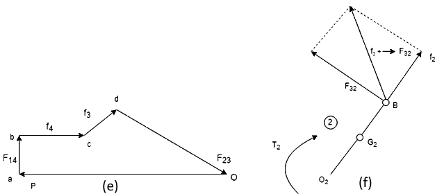
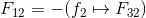
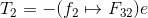

## INTRODUCTION 

#### Learning Objectives:

1. To identify all the forces acting on all the links of the slider crank.
2. To calculate the velocity, acceleration and force acting on each link.
3. To examine the calculated values with the simulation results.
4. To evaluate how change in length, angle and driving force results in change of acceleration, velocity and work done by the mechanism

#### **Theory**

The slider crank mechanism is one of the most basic forms of closed loop mechanisms, it is modification of the basic four bar chain. It has a single degree of freedom and is often used to convert rotary motion into linear motion by varying link lengths. It is, usually, found in reciprocating steam engine mechanism. From an application perspective it is very important to understand the dynamics of such a system. The kinematics of the system is largely governed by the link length and so is the dynamics of the system.<a href="references.html">[1]</a>

Through the process of the simulation, one would understand how to calculate the forces on each link for a constant angular velocity as input. The dynamic analysis of the slider crank mechanism is covered after understanding the kinematic analysis since the acceleration of the links are required to calculate the forces on the link.<a href="references.html">[1]</a>

#### Equations/formulas:

The slider crank mechanism is shown in Fig. (a). Let P be the force on the piston due to gas pressure and  the angular velocity of link 2, be known. Points ,, and  are the centers of mass of links 2, 3, and 4. We are interested to find the torque , which the crank 2 exerts on the crankshaft and the shaking force.

The velocity and acceleration polygons are constructed first, as shown in Fig. (b) and (c), respectively. Link 3 and 4 combined as a free body are shown in Fig. (d). The unknowns are the magnitudes of  and . By taking moments about B, we have

or

Force  can then be found by a summation of forces on bodies 3 and 4 together as a free body. The force polygon is shown in Fig. (e)

(a)	Configuration diagram

 

Fig. 1 Static and inertia force analysis of slider-crank mechanism

The free body diagram for link 2 is shown in Fig. (f), where

The torque exerted by the shaft on the crank 2 at O2 is,

The torque exerted by the crank on the crankshaft is equal to  but opposite in sense to T. <a href="references.html">[2]</a> 

(Equation Generation Source: <a href="http://latex.codecogs.com/">latex.codecogs.com</a>)

